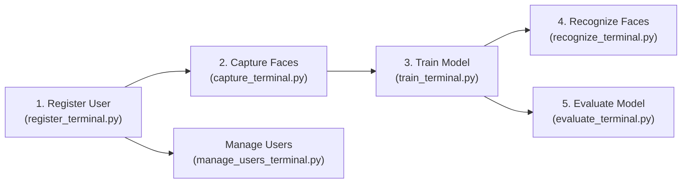

# 🔍 Face Recognition Project — Complete File-by-File Explanation

## Project Overview

This is a **Face Recognition System** built in Python. It allows you to:
1. Register users → 2. Capture their face images → 3. Train a model → 4. Recognize faces via webcam → 5. Evaluate model accuracy

The entire workflow runs from a **terminal/command-line** interface (no GUI needed).

---

## 📁 Project Structure

```
ml-2/
├── FaceRecognitionProject/          ← All source code
│   ├── app_terminal.py              ← 🚀 Main entry point (start here)
│   ├── register_terminal.py         ← 📝 Register new users
│   ├── capture_terminal.py          ← 📸 Capture face images
│   ├── train_terminal.py            ← 🧠 Train the face model
│   ├── recognize_terminal.py        ← 🎯 Live face recognition
│   ├── evaluate_terminal.py         ← 📊 Evaluate model metrics
│   ├── manage_users_terminal.py     ← 👥 View/delete users
│   ├── main.py                      ← 🔬 Standalone train+test+evaluate script
│   ├── requirements.txt             ← 📦 Dependencies
│   └── README.md                    ← 📖 Documentation
├── dataset/                         ← Face images (per-person subfolders)
│   ├── aryan/                       ← Images of "aryan"
│   └── yash/                        ← Images of "yash"
├── models/
│   └── trained_model.pkl            ← Serialized face model
└── users/
    └── users.csv                    ← Registered user records
```

---

## 1️⃣ [`requirements.txt`](file:///c:/Users/ASUS/OneDrive/Desktop/ml-2/FaceRecognitionProject/requirements.txt) — Dependencies

### What it is
A list of Python packages the project needs.

### Each dependency explained

| Package | Version | What it does |
|---|---|---|
| `opencv-python` | ≥4.8.0 | **Computer Vision library** — Opens webcam, reads/writes images, detects faces using Haar cascades, draws rectangles/text on frames |
| `face-recognition` | ≥1.3.0 | **Core ML library** — Uses dlib's deep learning model to generate a **128-dimensional face encoding** (a numeric fingerprint of a face) and compare faces |
| `numpy` | ≥1.24.0 | **Numeric computing** — Handles arrays, computes distances between face encodings, finds the closest match |
| `pandas` | ≥2.0.0 | **Data management** — Reads/writes the `users.csv` file, handles tabular data for user registration |
| `Pillow` | ≥10.0.0 | **Image processing** — Used internally by `face_recognition` to load image files |
| `scikit-learn` | ≥1.3.0 | **ML evaluation** — Computes accuracy, precision, recall, F1-score, confusion matrix, and does train/test splitting |

---

## 2️⃣ [`app_terminal.py`](file:///c:/Users/ASUS/OneDrive/Desktop/ml-2/FaceRecognitionProject/app_terminal.py) — 🚀 Main Entry Point

### What it is
**The main file you run** (`python app_terminal.py`). It shows a login screen, then a dashboard menu that connects to all other modules.

### Functions explained

#### [`init_csv_files()`](file:///c:/Users/ASUS/OneDrive/Desktop/ml-2/FaceRecognitionProject/app_terminal.py#L16-L26)
- **Purpose**: Creates the required folders (`users/`, `dataset/`, `models/`) and an empty `users.csv` file if they don't already exist.
- **Why needed**: Prevents "file not found" errors on first run. Ensures the project directories are always ready.

#### [`clear_screen()`](file:///c:/Users/ASUS/OneDrive/Desktop/ml-2/FaceRecognitionProject/app_terminal.py#L29-L31)
- **Purpose**: Clears the terminal screen.
- **How**: Uses `cls` on Windows, `clear` on Linux/Mac.

#### [`login()`](file:///c:/Users/ASUS/OneDrive/Desktop/ml-2/FaceRecognitionProject/app_terminal.py#L34-L65)
- **Purpose**: Asks for username and password. Only allows access if credentials are `admin` / `admin`.
- **How**: Gives the user **3 attempts**. Returns `True` on success, `False` on failure (exits the app).
- **Why needed**: Basic security gate so only authorized users can access the face recognition system.

#### [`show_dashboard()`](file:///c:/Users/ASUS/OneDrive/Desktop/ml-2/FaceRecognitionProject/app_terminal.py#L68-L121)
- **Purpose**: The **main menu loop**. Displays 7 options (1-6 + 0 to exit) and routes to the correct module.
- **How it works**:
  - Choice `1` → imports and calls `register_user()` from `register_terminal.py`
  - Choice `2` → imports and calls `capture_faces()` from `capture_terminal.py`
  - Choice `3` → imports and calls `train_model()` from `train_terminal.py`
  - Choice `4` → imports and calls `recognize_faces()` from `recognize_terminal.py`
  - Choice `5` → imports and calls `manage_users_menu()` from `manage_users_terminal.py`
  - Choice `6` → imports and calls `evaluate_model()` from `evaluate_terminal.py`
  - Choice `0` → exits the loop
- **Why lazy imports**: Each module is imported **inside** the `if` block (not at the top). This is deliberate — it avoids loading heavy libraries like `face_recognition` and `opencv` until they're actually needed, making the app start faster.

#### [`main()`](file:///c:/Users/ASUS/OneDrive/Desktop/ml-2/FaceRecognitionProject/app_terminal.py#L124-L129)
- **Purpose**: The entry point. Initializes CSV files, then runs login → dashboard.

---

## 3️⃣ [`register_terminal.py`](file:///c:/Users/ASUS/OneDrive/Desktop/ml-2/FaceRecognitionProject/register_terminal.py) — 📝 Register New Users

### What it is
Registers a new person into the system by saving their details to `users/users.csv`.

### Function explained

#### [`register_user()`](file:///c:/Users/ASUS/OneDrive/Desktop/ml-2/FaceRecognitionProject/register_terminal.py#L8-L50)
- **Purpose**: Collects person details (ID, Name, Department, Age) via terminal input and saves them to CSV.
- **Step-by-step**:
  1. Asks for 4 fields: Person ID, Full Name, Department, Age
  2. **Validates** — all fields must be non-empty
  3. **Checks for duplicates** — reads existing CSV and ensures the ID and Name are unique
  4. **Saves** — appends a new row to `users/users.csv` using pandas
- **Why needed**: You must register a person before you can capture their face images. This creates the record that links a name to face data.

---

## 4️⃣ [`capture_terminal.py`](file:///c:/Users/ASUS/OneDrive/Desktop/ml-2/FaceRecognitionProject/capture_terminal.py) — 📸 Capture Face Images

### What it is
The **data collection module**. It gathers face images for a registered person — either by uploading existing photos or capturing from webcam. Images are saved into `dataset/<person_name>/`.

### Functions explained

#### [`_get_registered_users()`](file:///c:/Users/ASUS/OneDrive/Desktop/ml-2/FaceRecognitionProject/capture_terminal.py#L12-L21)
- **Purpose**: Reads `users.csv` and returns a list of all registered names.
- **Why**: You can only capture faces for someone who is already registered.

#### [`_select_user(names)`](file:///c:/Users/ASUS/OneDrive/Desktop/ml-2/FaceRecognitionProject/capture_terminal.py#L24-L40)
- **Purpose**: Displays a numbered list of registered users and lets you pick one.
- **Returns**: The selected person's name (e.g., `"aryan"`).

#### [`_imread_unicode(path)`](file:///c:/Users/ASUS/OneDrive/Desktop/ml-2/FaceRecognitionProject/capture_terminal.py#L43-L53)
- **Purpose**: Reads an image file that may have **Unicode characters** in its path (e.g., Hindi or special characters).
- **Why needed**: OpenCV's `cv2.imread()` **fails on non-ASCII file paths** on Windows. This function works around that by reading the file as raw bytes and decoding it with `cv2.imdecode()`.

#### [`_imwrite_unicode(path, img)`](file:///c:/Users/ASUS/OneDrive/Desktop/ml-2/FaceRecognitionProject/capture_terminal.py#L56-L67)
- **Purpose**: Writes an image to a path that may have Unicode characters.
- **Why needed**: Same reason as above — `cv2.imwrite()` also fails on non-ASCII paths on Windows.

#### [`_get_image_files(path)`](file:///c:/Users/ASUS/OneDrive/Desktop/ml-2/FaceRecognitionProject/capture_terminal.py#L70-L85)
- **Purpose**: Given a file or folder path, returns a list of all image files (`.jpg`, `.png`, etc.).
- **Why**: Lets you provide either a single image file or an entire folder of images.

#### [`_upload_images(selected_name)`](file:///c:/Users/ASUS/OneDrive/Desktop/ml-2/FaceRecognitionProject/capture_terminal.py#L88-L155)
- **Purpose**: Upload face images by entering file/folder paths in the terminal.
- **Step-by-step**:
  1. Creates `dataset/<name>/` folder
  2. Loads **Haar Cascade** face detector (`haarcascade_frontalface_default.xml`)
  3. Loops, asking for image/folder paths (type `done` to stop)
  4. For each image: reads it → detects faces → **crops the face region** → saves the cropped face
  5. If no face is detected, saves the full image anyway
- **Why Haar Cascade?**: It's a fast, pre-trained face detector from OpenCV. It locates face rectangles in an image so we can crop just the face.

#### [`_capture_from_camera(selected_name)`](file:///c:/Users/ASUS/OneDrive/Desktop/ml-2/FaceRecognitionProject/capture_terminal.py#L158-L215)
- **Purpose**: Opens the webcam and automatically captures up to **50 face images**.
- **Step-by-step**:
  1. Opens webcam via `cv2.VideoCapture(0)` (tries camera 1 if 0 fails)
  2. Uses Haar Cascade to detect faces in each frame
  3. Crops and saves each detected face
  4. Draws green rectangles around faces and shows a counter on screen
  5. Stops when 50 images are captured or user presses `q`
- **Why 50 images**: More training images = better recognition accuracy. 50 images with slight head turns captures different angles.

#### [`capture_faces()`](file:///c:/Users/ASUS/OneDrive/Desktop/ml-2/FaceRecognitionProject/capture_terminal.py#L218-L249)
- **Purpose**: The main menu for capturing. Lets you choose between upload or webcam capture.

---

## 5️⃣ [`train_terminal.py`](file:///c:/Users/ASUS/OneDrive/Desktop/ml-2/FaceRecognitionProject/train_terminal.py) — 🧠 Train the Face Model

### What it is
Reads all face images from `dataset/`, converts each face into a **128-dimensional encoding** (a numeric fingerprint), and saves them as a `.pkl` model file.

### Function explained

#### [`train_model()`](file:///c:/Users/ASUS/OneDrive/Desktop/ml-2/FaceRecognitionProject/train_terminal.py#L10-L75)
- **Purpose**: Generate face encodings and save the trained model.
- **Step-by-step**:
  1. Lists all person folders inside `dataset/`
  2. For each person, loads every image file
  3. Uses `face_recognition.load_image_file()` to read the image
  4. Uses `face_recognition.face_encodings()` to compute a **128-D vector** — this is the "fingerprint" of the face
  5. Stores all encodings and their corresponding names in two lists
  6. Saves them as a Python dictionary `{"encodings": [...], "names": [...]}` into `models/trained_model.pkl` using **pickle**
- **What is a 128-D encoding?**: The `face_recognition` library uses a deep neural network (from dlib) that maps any face image to a 128-number vector. Faces of the **same person** produce **similar vectors** (small distance), while different people produce **distant vectors**.
- **What is `.pkl`?**: A **pickle file** — Python's way of serializing objects to disk so they can be loaded later without recomputing.

---

## 6️⃣ [`recognize_terminal.py`](file:///c:/Users/ASUS/OneDrive/Desktop/ml-2/FaceRecognitionProject/recognize_terminal.py) — 🎯 Live Face Recognition

### What it is
Opens the webcam and performs **real-time face recognition** — identifies who is in front of the camera by comparing against the trained model.

### Function explained

#### [`recognize_faces()`](file:///c:/Users/ASUS/OneDrive/Desktop/ml-2/FaceRecognitionProject/recognize_terminal.py#L13-L122)
- **Purpose**: Live webcam face recognition with bounding boxes, names, and confidence %.
- **Step-by-step**:
  1. **Loads the model** from `models/trained_model.pkl`
  2. Opens the webcam
  3. For each frame:
     - **Shrinks** the frame to 1/4 size (for speed)
     - Converts BGR → RGB (face_recognition expects RGB)
     - Detects face locations using `face_recognition.face_locations()` (uses HOG or CNN)
     - Computes 128-D encodings for detected faces
     - **Compares** each detected face against all known encodings using `face_recognition.compare_faces()` (with tolerance 0.5)
     - Finds the **closest match** using `face_recognition.face_distance()` (picks the minimum distance)
     - Computes **confidence** = `(1 - distance) × 100%`
  4. **Draws results** on the original full-size frame:
     - Green box + name + confidence % for recognized faces
     - Red box + "UNKNOWN" for unrecognized faces
     - FPS counter in top-left corner
  5. Stops when user presses `q`
- **Why process every other frame?**: The `process_this_frame` flag alternates — it only runs the expensive face detection on every **2nd frame** to maintain smooth FPS while still showing results on all frames.
- **Why shrink to 1/4?**: Face detection is computationally expensive. Shrinking the image makes it **16x faster** (1/4 width × 1/4 height), then coordinates are scaled back up (×4) for drawing.

---

## 7️⃣ [`evaluate_terminal.py`](file:///c:/Users/ASUS/OneDrive/Desktop/ml-2/FaceRecognitionProject/evaluate_terminal.py) — 📊 Evaluate Model Accuracy

### What it is
Tests how accurate the face recognition model is using **Leave-One-Out Cross-Validation (LOOCV)** and prints detailed metrics.

### Functions explained

#### [`_load_encodings()`](file:///c:/Users/ASUS/OneDrive/Desktop/ml-2/FaceRecognitionProject/evaluate_terminal.py#L13-L50)
- **Purpose**: Same as training — loads all images from `dataset/` and computes 128-D encodings.
- **Why separate from train?**: The evaluation needs fresh encodings (not the saved model), because LOOCV requires removing one sample at a time.

#### [`evaluate_model()`](file:///c:/Users/ASUS/OneDrive/Desktop/ml-2/FaceRecognitionProject/evaluate_terminal.py#L53-L180)
- **Purpose**: Runs LOOCV and prints accuracy, precision, recall, F1-score, and confusion matrix.
- **How LOOCV works**:
  1. For each sample `i`, **remove it** from the training set
  2. Use the remaining `N-1` samples as "known faces"
  3. Try to predict the label of sample `i` by comparing it against the remaining samples
  4. Record whether the prediction was correct
  5. Repeat for all N samples
- **Metrics printed**:
  - **Accuracy** — % of correct predictions overall
  - **Precision** — Of all times we predicted "aryan", how often was it actually aryan?
  - **Recall** — Of all actual "aryan" samples, how many did we correctly identify?
  - **F1-Score** — Harmonic mean of precision and recall (balanced measure)
  - **Confusion Matrix** — Shows exactly which persons got confused with whom
- **Why LOOCV?**: With small datasets (like 50 images per person), LOOCV uses the **maximum possible training data** for each test, giving the most reliable evaluation.

#### [`_export_report()`](file:///c:/Users/ASUS/OneDrive/Desktop/ml-2/FaceRecognitionProject/evaluate_terminal.py#L183-L217)
- **Purpose**: Exports the evaluation results to a timestamped CSV file in the `models/` folder.
- **Why**: So you can save and compare results across different training runs.

---

## 8️⃣ [`manage_users_terminal.py`](file:///c:/Users/ASUS/OneDrive/Desktop/ml-2/FaceRecognitionProject/manage_users_terminal.py) — 👥 Manage Users

### What it is
View all registered users and delete them if needed.

### Functions explained

#### [`_load_users()`](file:///c:/Users/ASUS/OneDrive/Desktop/ml-2/FaceRecognitionProject/manage_users_terminal.py#L10-L18)
- **Purpose**: Reads `users/users.csv` and returns a pandas DataFrame.
- **Returns**: Both the DataFrame and the CSV path (for later saving).

#### [`_print_users(df)`](file:///c:/Users/ASUS/OneDrive/Desktop/ml-2/FaceRecognitionProject/manage_users_terminal.py#L21-L33)
- **Purpose**: Displays all users in a nicely formatted table (columns: #, ID, Name, Department, Age).

#### [`manage_users_menu()`](file:///c:/Users/ASUS/OneDrive/Desktop/ml-2/FaceRecognitionProject/manage_users_terminal.py#L36-L95)
- **Purpose**: Interactive menu loop with 3 options: delete user(s), refresh list, or go back.
- **Delete behavior**:
  1. Asks for row numbers to delete (comma-separated for multiple)
  2. Asks for confirmation
  3. **Deletes the user's face images** from `dataset/<name>/` (using `shutil.rmtree`)
  4. Removes the row from the CSV
- **Why delete images too?**: If you only delete the CSV record but leave images in `dataset/`, the training would still include that person, causing inconsistency.

---

## 9️⃣ [`main.py`](file:///c:/Users/ASUS/OneDrive/Desktop/ml-2/FaceRecognitionProject/main.py) — 🔬 Standalone Train + Test + Evaluate

### What it is
A **self-contained script** that does everything in one run: loads dataset → splits into train/test → trains → predicts → evaluates. Unlike the modular terminal app, this runs **non-interactively**.

### Functions explained

#### [`load_dataset(dataset_path)`](file:///c:/Users/ASUS/OneDrive/Desktop/ml-2/FaceRecognitionProject/main.py#L32-L76)
- **Purpose**: Loads all face images from `dataset/`, computes 128-D encodings, returns lists of encodings and labels.
- **Same as train_terminal.py**, but in a standalone context.

#### [`predict(train_encodings, train_labels, test_encoding, tolerance)`](file:///c:/Users/ASUS/OneDrive/Desktop/ml-2/FaceRecognitionProject/main.py#L82-L97)
- **Purpose**: Predicts the identity of a single face encoding using **nearest-neighbor** matching.
- **How**:
  1. Computes distances from the test encoding to ALL training encodings
  2. Finds the **closest** (minimum distance) training sample
  3. Checks if this closest match is within the `tolerance` (0.5)
  4. If yes → returns that person's name. If no → returns "UNKNOWN"

#### [`main()`](file:///c:/Users/ASUS/OneDrive/Desktop/ml-2/FaceRecognitionProject/main.py#L103-L208)
- **Purpose**: Orchestrates the complete pipeline:
  1. **Load** — calls `load_dataset()`
  2. **Split** — uses sklearn's `train_test_split()` with 80/20 ratio and `stratify` (ensures balanced split)
  3. **Save** — pickles the training encodings to `models/trained_model.pkl`
  4. **Predict** — runs `predict()` on every test sample
  5. **Evaluate** — computes and prints accuracy, F1-score, classification report, and confusion matrix

---

## 🗂️ Data Files

### [`users/users.csv`](file:///c:/Users/ASUS/OneDrive/Desktop/ml-2/users/users.csv)
Stores registered user records:
```
ID,Name,Department,Age
44,aryan,cs,20
31,yash,cs,20
```

### `models/trained_model.pkl`
A **pickle file** containing a dictionary:
```python
{"encodings": [array_128d_1, array_128d_2, ...], "names": ["aryan", "aryan", ..., "yash", ...]}
```

### `dataset/aryan/` and `dataset/yash/`
Folders containing cropped face images (`.jpg`) for each person.

---

## 🔄 Complete Workflow



| Step | File | Input | Output |
|------|------|-------|--------|
| Register | `register_terminal.py` | User details (ID, name, dept, age) | Row in `users.csv` |
| Capture | `capture_terminal.py` | Webcam/image files | Face images in `dataset/<name>/` |
| Train | `train_terminal.py` | Images in `dataset/` | `models/trained_model.pkl` |
| Recognize | `recognize_terminal.py` | Live webcam + trained model | Bounding boxes + names on screen |
| Evaluate | `evaluate_terminal.py` | Images in `dataset/` | Accuracy, F1, confusion matrix |
